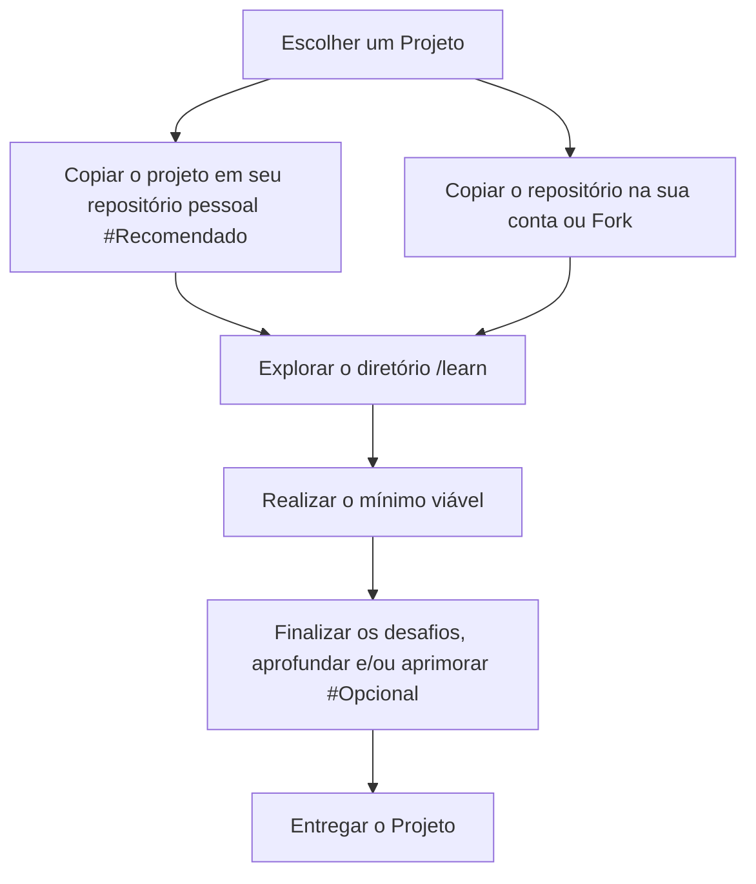

# Instruções Gerais

> Bem-vindo ao lugar em que a teoria deixa de ser só teoria!

Aqui você encontra projetos de cibersegurança feitos para sair do slide e entrar no terminal: entender sistemas, criar ferramentas, analisar comportamento, tomar decisões técnicas e aprender como a segurança funciona na prática. Isso aqui não é um inventário de ferramentas. É uma **trilha de aprendizado**: cada projeto tem um papel claro, exige um esforço previsível e te leva para o próximo passo construindo a sua base.

_Você poderá seguir com as orientações (workflow) e realizar o mínimo previsto ou poderá se aventurar e consolidar um portfólio forte com mais de um projeto, bem como o quão disposto estiver de aprimorar os códigos e funcionalidades._

## 📈 Grafo de Workflow

---

## 🎯 Níveis de Dificuldade

| Nível | Rótulo        | Descrição                                                     |
| ----- | ------------- | ------------------------------------------------------------- |
| N1    | Iniciante     | Fundamentos, escopo contido, sem barreira de tooling          |
| N2    | Básico        | Primeiros conceitos aplicados, tooling simples                |
| N3    | Intermediário | Engenharia aplicada, exige domínio de conceitos e ferramentas |
| N4    | Avançado      | Projeto complexo, exige maturidade técnica e integração       |
| N5    | Especialista  | Projeto de alto nível, exige domínio e arquitetura            |

---

## 🧩 Ramos Temáticos

| Ramo  | Tema                   | Individual     | Team           | Dificuldade |
| ----- | ---------------------- | -------------- | -------------- | ----------- |
| **A** | Cryptography & Hashing | `Hash_ID`      | `Hash_Cracker` | N1 → N4     |
| **B** | Web & Supply Chain     | `Headers`      | `V_Scanner`    | N2 → N4     |
| **C** | Network Security       | `Port_Scanner` | `Net_Analyzer` | N3 → N5     |
| **D** | Secrets & Detection    | `Pass_Vault`   | `Secrets`      | N4 → N5     |

---

  

# 📊 Catálogo Completo de Projetos

## Ramo A — Cryptography & Hashing

### Individual: Hash_ID

**Objetivo:** Identificar algoritmos de hash a partir de sua saída (fingerprint, padrão, comportamento).

**O que você vai aprender:**

- Características de diferentes funções hash (MD5, SHA-1, SHA-256, etc.)
- Padrões de output e identificação visual
- Fundamentos de hashing criptográfico
- Como hash é usado em contextos reais

**Learning Resources:** Veja [`README`](./projects/Individual/a-Hash_ID/README.md).

---

### Team: Hash_Cracker

**Objetivo:** Construir uma ferramenta capaz de quebrar hashes usando técnicas de brute force, dicionário e otimizações paralelas.

**O que você vai aprender:**

- Otimização e paralelismo (threads, SIMD)
- Ataques offline contra hashes
- Performance crítica em C++
- Integração de wordlists e estratégias de ataque

**Learning Resources:** Veja [`README`](./projects/Team/a-Hash_Cracker/README.md).

**Progressão:** Evolução natural de Hash_ID com foco em engenharia prática.

---

## Ramo B — Web & Supply Chain

### Individual: Headers

**Objetivo:** Analisar headers HTTP para extrair informações de segurança, configuração e pegada de servidores.

**O que você vai aprender:**

- Anatomia de headers HTTP
- Headers de segurança (CSP, X-Frame-Options, Strict-Transport-Security, etc.)
- Fingerprinting de servidores e tecnologias
- Descoberta de tecnologia via análise passiva

**Learning Resources:** Veja [`README`](./projects/Individual/b-Headers/README.md).

---

### Team: V_Scanner

**Objetivo:** Construir um scanner de dependências Python que identifica vulnerabilidades em supply chain usando OSV.dev e PyPI.

**O que você vai aprender:**

- Supply chain security
- APIs de vulnerabilidade (OSV.dev)
- Análise de dependências
- Go para ferramentas de segurança
- Integração com ecosistemas de pacotes

**Learning Resources:** Veja [`README`](./projects/Team/b-V_Scanner/README.md).

**Progressão:** Evolução natural de Headers com foco em segurança de supply chain.

---

## Ramo C — Network Security

### Individual: Port_Scanner

**Objetivo:** Implementar um scanner de portas que mapeia serviços e versões em hosts remotos.

**O que você vai aprender:**

- Sockets e programação de rede (raw sockets, conectividade)
- Técnicas de scanning (SYN, connect, UDP)
- Timeout e tratamento de erros de rede
- Mapeamento de ativos e inventário de serviços

**Learning Resources:** Veja [`README`](./projects/Individual/c-Port_Scanner/README.md).

---

### Team: Net_Analyzer

**Objetivo:** Construir um analisador de tráfego que captura, decodifica e interpreta protocolos de rede em tempo real.

**O que você vai aprender:**

- Captura de pacotes e análise de tráfego
- Decodificação de protocolos (TCP/IP, DNS, HTTP, etc.)
- Reconstrução de sessões
- Análise forense de tráfego

**Learning Resources:** Veja [`README`](./projects/Team/c-Net_Analyzer/README.md).

**Progressão:** Evolução natural de Port_Scanner com foco em análise profunda.

---

## Ramo D — Secrets & Detection

### Individual: Pass_Vault

**Objetivo:** Implementar um gerenciador de senhas seguro que armazena credenciais com criptografia forte e práticas de segurança.

**O que você vai aprender:**

- Armazenamento seguro de senhas (KDF, salt, algoritmos modernos)
- Derivação de chaves (PBKDF2, Argon2, scrypt)
- Criptografia simétrica (AES-256-GCM)
- Proteção de segredos contra ataques de side-channel
- Boas práticas de gerenciamento de credenciais

**Learning Resources:** Veja [`README`](./projects/Individual/d-Pass_Vault/README.md).

---

### Team: Secrets

**Objetivo:** Construir uma ferramenta que detecta exposição de segredos em repositórios e artefatos.

**O que você vai aprender:**

- Detecção de padrões de segredos
- Scanning de repositórios Git
- Análise de artefatos (binários, logs, configurações)
- Resposta a vazamentos
- Integração com CI/CD para detecção precoce

**Learning Resources:** Veja [`README`](./projects/Team/d-Secrets/README.md).

**Progressão:** Evolução natural de Pass_Vault com foco em detecção operacional.

---

  

# 🔴 Entrega

Em seu projeto, no seu repositório, deverá haver uma pasta `DEMO.md`.

A demo é a **prova prática** de que o projeto foi concluído. Ela deve mostrar:

- Que a ferramenta **funciona** de verdade;
- Que você **entende** o que construiu;
- Que as decisões técnicas são **justificáveis**;
- Que o aprendizado pode ser **compartilhado** com outros membros.

## 🎬 Padrão de Demo

Na primeira parte do arquivo você deve explicar brevemente, em formato markdown, sobre o projeto, apresentar resultados e suas conclusões seguindo os critérios de avaliação da demo. Então, a segunda parte do arquivo se divide em duas possibilidades (depende do tipo de projeto):

> _**INDIVIDUAL:**_ Faça um vídeo explicando sobre o que escreveu, porém, mostrando na prática as aplicações e ferramentas desenvolvidas. Siga o modelo de vídeo sugerido, se achar necessário.

> _**TEAM:**_ Faça um GIF mostrando as principais funções desenvolvidas no seu projeto. Seja breve e preciso. Recomendo utilizar [`asciinema`](https://asciinema.org), [`agg`](https://github.com/asciinema/agg) (para gerar GIF a partir de asciinema) ou [`peek`](https://github.com/phw/peek) (para gravar GIFs de tela). A apresentação do projeto de seu grupo será ao vivo, onde serão trabalhadas as explicações com mais detalhes.

## Modelo de vídeo sugerido (Projeto Individual):

Deve durar **5–10 minutos** e seguir esta estrutura:

### 1. Contexto (1 min)

- Qual é o problema que o projeto resolve?
- Por que isso importa em segurança?

### 2. O que foi construído (1 min)

- Visão geral da ferramenta/script.
- Stack utilizada.
- Arquitetura principal (fluxo de dados).

### 3. Execução ao vivo (3–5 min)

- Execute a ferramenta com um caso real.
- Mostre a saída esperada.
- Explique **o que está acontecendo** em cada etapa.

### 4. Decisões técnicas (1–2 min)

- Explique 1–2 decisões importantes:
  - Por que escolheu essa abordagem?
  - Que trade-offs enfrentou?
  - O que você faria diferente?

### 5. Validação e testes (1 min)

- Mostre que os testes passam (`just test`, `just lint`).
- Mostre a validação da seção `Validation` do README.

### 6. Próximos passos (30s)

- O que você aprendeu?
- Para onde o projeto aponta (Next Step)?

## Critérios de Avaliação da Demo

| Critério           | O que é avaliado                                   |
| ------------------ | -------------------------------------------------- |
| **Funcionalidade** | A ferramenta executa e produz o resultado esperado |
| **Compreensão**    | O autor explica o que está acontecendo e por quê   |
| **Validação**      | Testes e validação documentados foram executados   |
| **Comunicação**    | A apresentação é clara, objetiva e técnica         |
| **Segurança**      | A demo foi executada em ambiente autorizado        |

---

  

# ⚠️ Aviso Legal

> [!IMPORTANT]
> Todos os projetos deste repositório devem ser executados somente em ambientes próprios ou explicitamente autorizados. O uso indevido das ferramentas aqui desenvolvidas é de responsabilidade exclusiva do usuário.
>
> Antes de executar qualquer ferramenta ou ataque, **obtenha autorização escrita** do dono ou administrador do sistema. Violação das leis de segurança cibernética é crime.

---

Boa exploração — com responsabilidade. 🛡️
