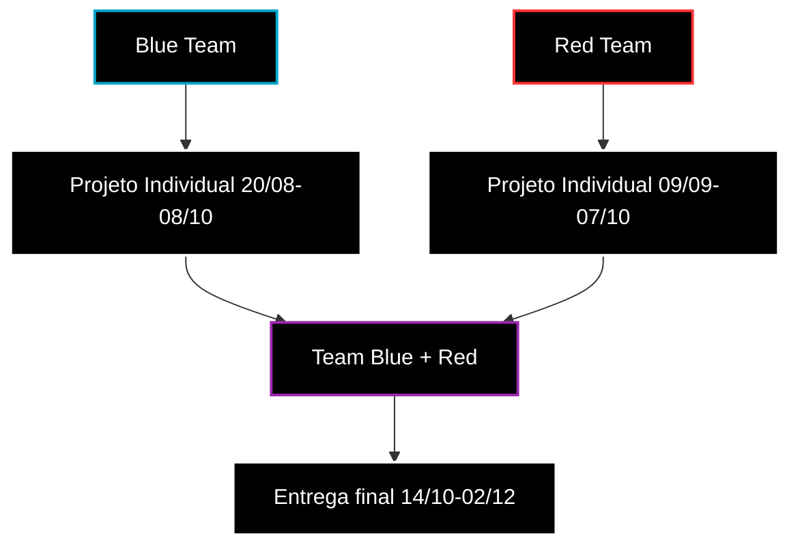

# 🛡️ Insper Sec — Trilha de Projetos em Cibersegurança

> [!NOTE]
> Repositório educacional dos grandes projetos do **Insper Sec**.

> [!TIP]
> Veja as [Instruções](INSTRUCTIONS.md) do Repositório para direcionamento.

---

## 🧭 Organização Semestral

- O Projeto **Individual** representa uma **entrega intermediária** — foco em fundamentos.
- O Projeto **Team** representa a **entrega final do semestre** — foco em integração e complexidade, com apresentação à Insper Sec.
- O Team final é misto entre **Blue** e **Red**, em grupos compartilhados.

---

## 🚀 Por onde começar?

O caminho mais natural depende do perfil do membro:

1. **Red Team**: comece pelo projeto individual do ramo que te interessa ou, se você for iniciante, opte pelo Hash_ID ou Headers.
2. **Blue Team**: escolha o que o seu coração mandar!
     

- **Dificuldade** e **profundidade** dos projetos é você quem escolhe.

> **_A progressão não é linear_**

---

## 📊 Resumo dos projetos

| Projeto                                                        | Modo       | Dificuldade   | Nível | Stack        |
| -------------------------------------------------------------- | ---------- | ------------- | ----- | ------------ |
| [`Hash_ID`](./projects/Individual/Hash_ID/README.md)           | Individual | Iniciante     | N1    | Python       |
| [`Headers`](./projects/Individual/Headers/README.md)           | Individual | Básico        | N2    | Python       |
| [`Port_Scanner`](./projects/Individual/Port_Scanner/README.md) | Individual | Intermediário | N3    | C++          |
| [`Pass_Vault`](./projects/Individual/Pass_Vault/README.md)     | Individual | Avançado      | N4    | Python       |
| [`Hash_Cracker`](./projects/Team/Hash_Cracker/README.md)       | Team       | Avançado      | N4    | C++          |
| [`V_Scanner`](./projects/Team/V_Scanner/README.md)             | Team       | Avançado      | N4    | Go           |
| [`Net_Analyzer`](./projects/Team/Net_Analyzer/README.md)       | Team       | Especialista  | N5    | Python / C++ |
| [`Secrets`](./projects/Team/Secrets/README.md)                 | Team       | Especialista  | N5    | Go           |

---

## 🧠 O que você vai aprender

Ao longo da trilha, você desenvolverá:

- **Fundamentos de criptografia** — hashes, KDFs, cifras autenticadas, modelagem de ameaça
- **Segurança web** — HTTP, headers de segurança, análise de configuração
- **Redes** — sockets, protocolos, captura e análise de tráfego
- **Credenciais e segredos** — armazenamento seguro, detecção de exposição
- **Supply chain** — dependências, SBOM, vulnerabilidades
- **Metodologia de equipe** — divisão de trabalho, integração, milestones
- **Postura defensiva** — detecção, monitoramento, resposta

---

## ⚠️ Aviso legal

> [!IMPORTANT]
> Todos os projetos deste repositório devem ser executados somente em ambientes próprios ou explicitamente autorizados. O uso indevido das ferramentas aqui desenvolvidas é de responsabilidade exclusiva do usuário.

---

Boa exploração — com responsabilidade.
