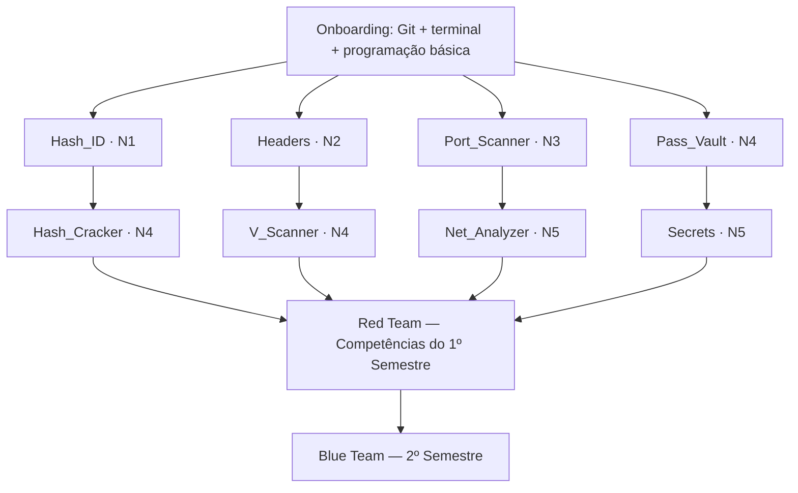

# 🛡️ Insper Sec — Trilha de Projetos em Cibersegurança

> [!NOTE]
> Repositório educacional dos grandes projetos do **Insper Sec**.

Bem-vindo ao lugar em que a teoria deixa de ser só teoria.

Aqui você encontra projetos de cibersegurança pensados para transformar conceitos em prática real: entender sistemas, construir ferramentas, analisar comportamento, tomar decisões técnicas e aprender como segurança funciona quando sai do slide e entra no terminal.

Este repositório é uma **trilha educacional**, não um inventário de ferramentas. Cada projeto tem um papel pedagógico claro: ensinar um conjunto de conceitos, exigir um esforço previsível e preparar você para o próximo passo.

---

## 🧭 Como a trilha se organiza

A trilha é organizada em **semestres**, cada um com um objetivo pedagógico distinto:

|                  Frente                   | Semestre | Cor |    Foco    | Papel pedagógico                                                    |
| :---------------------------------------: | :------: | :-: | :--------: | ------------------------------------------------------------------- |
|    [**Red Team**](./RedTeam/README.md)    |    1º    | 🔴  |  Ofensivo  | Observar, mapear, testar e explorar sistemas em contexto autorizado |
|   [**Blue Team**](./BlueTeam/README.md)   |    2º    | 🔵  | Defensivo  | Observar, detectar, investigar, responder e endurecer sistemas      |
| [**Purple Team**](./PurpleTeam/README.md) |   3º+    | 💜  | Integração | Executar Red → detectar Blue → refletir e melhorar a trilha         |

> **Modelo semestral:** dentro de cada semestre, o projeto **Individual** representa uma **entrega intermediária**, e o projeto **Team** representa a **entrega final do semestre**, com apresentação à Insper Sec.

> [!TIP]
> A progressão **não é linear**. O currículo é organizado em **ramos temáticos paralelos** que convergem em uma atividade integradora (Purple). Veja o [mapa curricular completo](./docs/CURRICULUM.md).

---

## 🚀 Por onde começar?

Se você é **novo(a) no Insper Sec**, siga este fluxo:

1. Leia este README para entender o mapa geral.
2. Escolha um ramo temático no [**Red Team**](./RedTeam/README.md).
3. Comece pelo projeto **Individual** do ramo escolhido.
4. Siga para o projeto **Team** do mesmo ramo (entrega final do semestre).
5. Ao final do semestre, avance para o [**Blue Team**](./BlueTeam/README.md) (2º semestre).
6. No 3º+ semestre, participe do [**Purple Capstone**](./PurpleTeam/README.md).

> [!IMPORTANT]
> **Primeiro passo concreto:** abra [`RedTeam/Individual/a-Hash_ID/README.md`](./RedTeam/Individual/a-Hash_ID/README.md) e siga o início rápido. É o ponto de entrada recomendado para quem nunca fez um projeto de segurança.

---

## 📚 Progressão sugerida

> Todos os 8 projetos consolidados pertencem ao **Red Team** (1º semestre). O Blue Team (2º semestre) e o Purple Team (3º+ semestre) são fases posteriores da trilha.

---

## 📊 Resumo dos projetos

| Projeto                                                         | Frente | Modo       | Dificuldade   | Nível | Stack        |
| --------------------------------------------------------------- | ------ | ---------- | ------------- | ----- | ------------ |
| [`Hash_ID`](./RedTeam/Individual/a-Hash_ID/README.md)           | Red    | Individual | Iniciante     | N1    | Python       |
| [`Headers`](./RedTeam/Individual/b-Headers/README.md)           | Red    | Individual | Básico        | N2    | Python       |
| [`Port_Scanner`](./RedTeam/Individual/c-Port_Scanner/README.md) | Red    | Individual | Intermediário | N3    | C++          |
| [`Pass_Vault`](./RedTeam/Individual/d-Pass_Vault/README.md)     | Red    | Individual | Avançado      | N4    | Python       |
| [`Hash_Cracker`](./RedTeam/Team/a-Hash_Cracker/README.md)       | Red    | Team       | Avançado      | N4    | C++          |
| [`V_Scanner`](./RedTeam/Team/b-V_Scanner/README.md)             | Red    | Team       | Avançado      | N4    | Go           |
| [`Net_Analyzer`](./RedTeam/Team/c-Net_Analyzer/README.md)       | Red    | Team       | Especialista  | N5    | Python / C++ |
| [`Secrets`](./RedTeam/Team/d-Secrets/README.md)                 | Red    | Team       | Especialista  | N5    | Go           |

> **Blue Team** (2º semestre) e **Purple Team** (3º+ semestre) estão em construção. Veja [BlueTeam/README.md](./BlueTeam/README.md) e [PurpleTeam/README.md](./PurpleTeam/README.md) para o estado atual.

---

## 🧠 O que você vai aprender

Ao longo da trilha, você desenvolverá:

- **Fundamentos de criptografia** — hashes, KDFs, cifras autenticadas, modelagem de ameaça
- **Segurança web** — HTTP, headers de segurança, análise de configuração
- **Redes** — sockets, protocolos, captura e análise de tráfego
- **Credenciais e segredos** — armazenamento seguro, detecção de exposição
- **Supply chain** — dependências, SBOM, vulnerabilidades
- **Metodologia de equipe** — divisão de trabalho, integração, milestones
- **Postura defensiva** — detecção, monitoramento, resposta

---

## ⚠️ Aviso legal

> [!IMPORTANT]
> Todos os projetos deste repositório devem ser executados somente em ambientes próprios ou explicitamente autorizados. O uso indevido das ferramentas aqui desenvolvidas é de responsabilidade exclusiva do usuário.

---

## 📚 Documentação transversal

- [**Mapa curricular completo**](./docs/CURRICULUM.md) — progressão, ramos, dificuldades
- [**Padrões de README**](./CONTRIBUTING.md#-padrões-de-readme) — convenções e contrato educacional padrão
- [**Guia de workflow**](./docs/WORKFLOW.md) — comandos, passo a passo e entregas de projeto
- [**Guia de demo**](./docs/DEMO_GUIDE.md) — roteiro de apresentação e critérios de avaliação
- [**Guia de contribuição**](./CONTRIBUTING.md) — como contribuir com novos projetos e melhorias
- [**CI de documentação**](./.github/workflows/docs-check.yml) — lint de Markdown e verificação de links

---

Boa exploração — com responsabilidade. 🛡️
