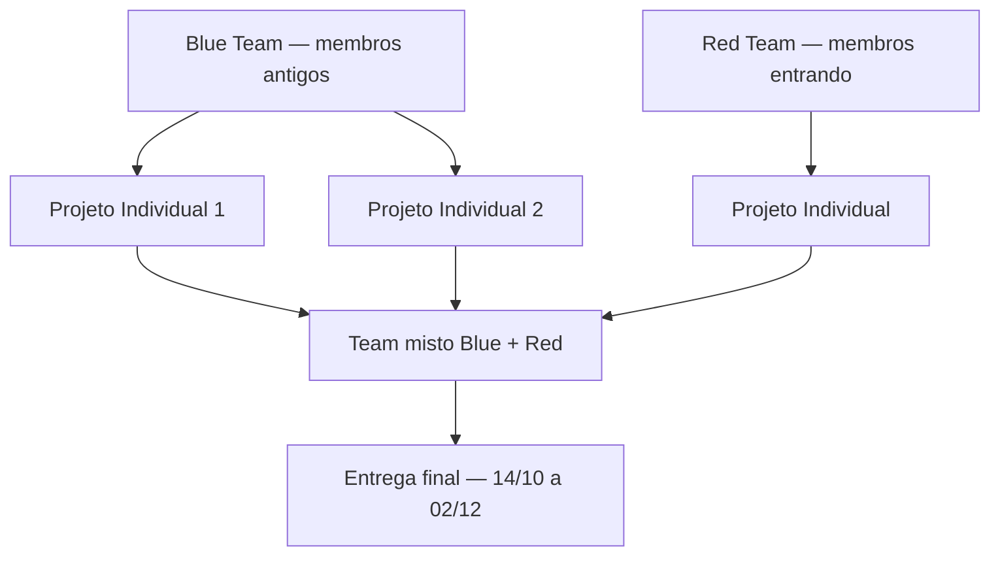

# 🛡️ Insper Sec — Trilha de Projetos em Cibersegurança

> [!NOTE]
> Repositório educacional dos grandes projetos do **Insper Sec**.

Bem-vindo ao lugar em que a teoria deixa de ser só teoria.

Aqui você encontra projetos de cibersegurança feitos para sair do slide e entrar no terminal: entender sistemas, criar ferramentas, analisar comportamento, tomar decisões técnicas e aprender como a segurança funciona na prática.

Isso aqui não é um inventário de ferramentas. É uma **trilha de aprendizado**: cada projeto tem um papel claro, exige um esforço previsível e te leva para o próximo passo sem perder a base.

---

## 🧭 Como a trilha se organiza neste semestre

No contexto atual do **início do 2º semestre de 2026**, a estrutura da turma foi ajustada para refletir a realidade do momento:

|  Frente atual   |      Perfil do grupo       |     Situação neste semestre     |                              Papel pedagógico                               |
| :-------------: | :------------------------: | :-----------------------------: | :-------------------------------------------------------------------------: |
|  **Red Team**   | membros que estão entrando |              ativa              |    onboarding, base técnica e primeiros projetos em contexto autorizado     |
|  **Blue Team**  |    membros mais antigos    |              ativa              | mesma trilha de projetos do Red Team, com aprofundamento e revisão aplicada |
| **Purple Team** |         integração         | ainda não existe neste semestre |                        será estruturado futuramente                         |

> No semestre atual, o **Blue Team** é composto por membros já no ciclo anterior, mas **executa o mesmo catálogo de 8 projetos do Red Team**. Os nomes que aparecem fora desse catálogo são apenas planejamento acadêmico, não conteúdo consolidado neste repositório. O **Purple Team** ainda não está ativo neste período.

> Veja a [**documentação completa de projetos**](./projects/README.md) para a organização detalhada de todos os projetos e ramos.

> **Modelo do semestre atual:** o projeto **Individual** representa uma entrega intermediária, e o projeto **Team** representa a entrega final do semestre. Neste ciclo, o **team é misto entre Blue e Red**, com grupos compartilhando a mesma janela de trabalho e o mesmo conjunto de projetos-base.

> [!TIP]
> A progressão **não é linear** e a trilha continua organizada em ramos temáticos paralelos. O mapa do semestre se ajusta à turma do momento. Veja o [mapa curricular completo](./docs/CURRICULUM.md).

---

## 🚀 Por onde começar?

Para este semestre, o caminho mais natural depende do perfil do membro:

1. **Se você está entrando no Red Team**, comece pelo projeto individual do ramo que te interessa.
2. **Se você já está no ciclo anterior e faz parte do Blue Team**, segue a mesma sequência de 8 projetos da trilha-base do semestre, com mais revisão e aprofundamento.
3. O **team** desta edição é compartilhado entre Blue e Red, com grupos mistos e a mesma janela de entrega para os dois lados.
4. O **Purple Team** ainda não está ativo neste período e vai ser estruturado mais para frente.

> [!IMPORTANT]
> **Sugestão para completos iniciantes:** abra [Hash_ID](./projects/Individual/a-Hash_ID/README.md) para começar por uma base sólida e bem guiada.

---

## 📚 Estrutura atual do semestre (2026/2)

> Neste semestre, a lógica é bem prática: **o Blue Team e o Red Team compartilham o mesmo catálogo de 8 projetos**, com o mesmo fluxo de Individual → Team e a mesma janela final em grupo misto.

> O **Purple Team** ainda não está ativo neste período; quando entrar em cena, ele vai ser estruturado de verdade.

---

## 📊 Resumo dos projetos

| Projeto                                                          | Frente | Modo       | Dificuldade   | Nível | Stack        |
| ---------------------------------------------------------------- | ------ | ---------- | ------------- | ----- | ------------ |
| [`Hash_ID`](./projects/Individual/a-Hash_ID/README.md)           | Red    | Individual | Iniciante     | N1    | Python       |
| [`Headers`](./projects/Individual/b-Headers/README.md)           | Red    | Individual | Básico        | N2    | Python       |
| [`Port_Scanner`](./projects/Individual/c-Port_Scanner/README.md) | Red    | Individual | Intermediário | N3    | C++          |
| [`Pass_Vault`](./projects/Individual/d-Pass_Vault/README.md)     | Red    | Individual | Avançado      | N4    | Python       |
| [`Hash_Cracker`](./projects/Team/a-Hash_Cracker/README.md)       | Red    | Team       | Avançado      | N4    | C++          |
| [`V_Scanner`](./projects/Team/b-V_Scanner/README.md)             | Red    | Team       | Avançado      | N4    | Go           |
| [`Net_Analyzer`](./projects/Team/c-Net_Analyzer/README.md)       | Red    | Team       | Especialista  | N5    | Python / C++ |
| [`Secrets`](./projects/Team/d-Secrets/README.md)                 | Red    | Team       | Especialista  | N5    | Go           |

> **Semestre atual (2026/2):** o **Blue Team** é formado por membros mais antigos, mas **segue o mesmo catálogo de 8 projetos do Red Team**. Veja [projects/README.md](./projects/README.md) para o estado atual.

---

## 🧠 O que você vai aprender

Ao longo da trilha, você desenvolverá:

- **Fundamentos de criptografia** — hashes, KDFs, cifras autenticadas, modelagem de ameaça
- **Segurança web** — HTTP, headers de segurança, análise de configuração
- **Redes** — sockets, protocolos, captura e análise de tráfego
- **Credenciais e segredos** — armazenamento seguro, detecção de exposição
- **Supply chain** — dependências, SBOM, vulnerabilidades
- **Metodologia de equipe** — divisão de trabalho, integração, milestones
- **Postura defensiva** — detecção, monitoramento, resposta

---

## ⚠️ Aviso legal

> [!IMPORTANT]
> Todos os projetos deste repositório devem ser executados somente em ambientes próprios ou explicitamente autorizados. O uso indevido das ferramentas aqui desenvolvidas é de responsabilidade exclusiva do usuário.

---

## 📚 Documentação transversal

- [**Trilha de projetos unificada**](./projects/README.md) — catálogo completo, progressão, ramos, dificuldades
- [**Mapa curricular**](./docs/CURRICULUM.md) — progressão, ramos, dificuldades, relações entre projetos
- [**Padrões de README**](./CONTRIBUTING.md#-padrões-de-readme) — convenções e contrato educacional padrão
- [**Guia de workflow**](./docs/WORKFLOW.md) — comandos, passo a passo e entregas de projeto
- [**Guia de demo**](./docs/DEMO_GUIDE.md) — roteiro de apresentação e critérios de avaliação
- [**Guia de contribuição**](./CONTRIBUTING.md) — como contribuir com novos projetos e melhorias
- [**CI de documentação**](./.github/workflows/docs-check.yml) — lint de Markdown e verificação de links

---

Boa exploração — com responsabilidade.
