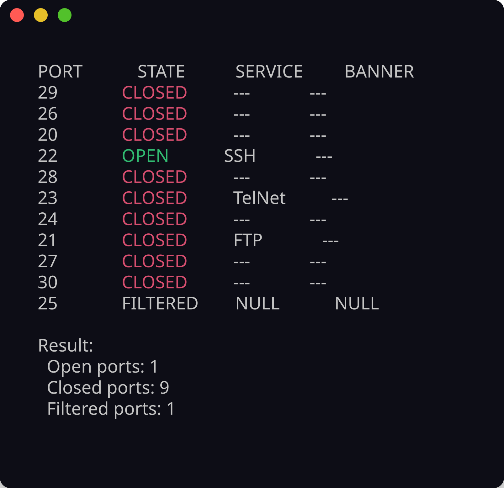
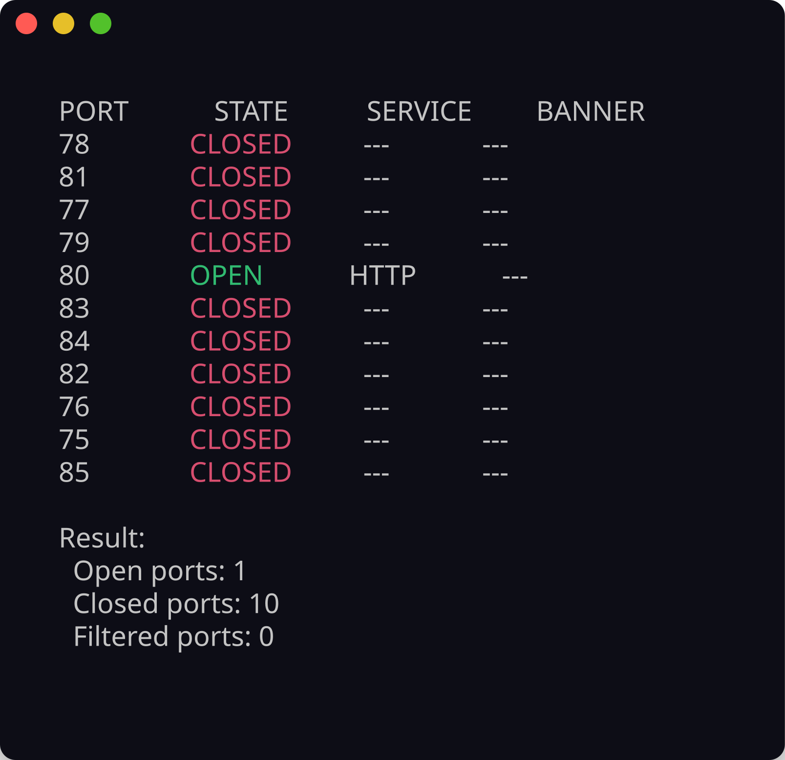

<!-- ©AngelaMos | 2026 -->
<!-- DEMO.md -->

<div align="center">

```ruby
██████╗  ██████╗ ██████╗ ████████╗    ███████╗ ██████╗ █████╗ ███╗   ██╗███╗   ██╗███████╗██████╗
██╔══██╗██╔═══██╗██╔══██╗╚══██╔══╝    ██╔════╝██╔════╝██╔══██╗████╗  ██║████╗  ██║██╔════╝██╔══██╗
██████╔╝██║   ██║██████╔╝   ██║       ███████╗██║     ███████║██╔██╗ ██║██╔██╗ ██║█████╗  ██████╔╝
██╔═══╝ ██║   ██║██╔══██╗   ██║       ╚════██║██║     ██╔══██║██║╚██╗██║██║╚██╗██║██╔══╝  ██╔══██╗
██║     ╚██████╔╝██║  ██║   ██║       ███████║╚██████╗██║  ██║██║ ╚████║██║ ╚████║███████╗██║  ██║
╚═╝      ╚═════╝ ╚═╝  ╚═╝   ╚═╝       ╚══════╝ ╚═════╝╚═╝  ╚═╝╚═╝  ╚═══╝╚═╝  ╚═══╝╚══════╝╚═╝  ╚═╝
```

**Demonstração e Prévia**

<br>

<a href="https://github.com/CarterPerez-dev/Cybersecurity-Projects/tree/main/PROJECTS/beginner/simple-port-scanner">
  
</a>

<br>

```ruby
mkdir build && cd build && cmake .. && make
./simplePortScanner -i <target> -p <range>
```

<br>

[Descoberta de SSH](#ssh-discovery) · [Descoberta de HTTP](#http-discovery)

</div>

---

### Descoberta de SSH

Scan TCP assíncrono contra scanme.nmap.org com mapeamento de serviço detalhado mostrando estados OPEN/CLOSED/FILTERED em todo o intervalo de portas conhecidas de SSH



---

### Descoberta de HTTP

Scan concorrente em toda a janela de portas HTTP com identificação de serviço por porta e contagem de resultados agregados


