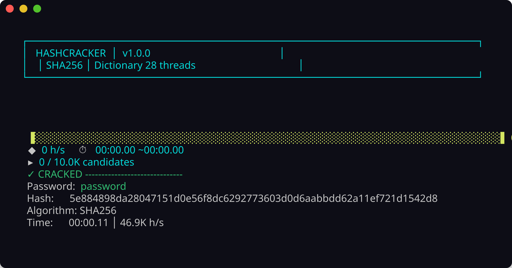
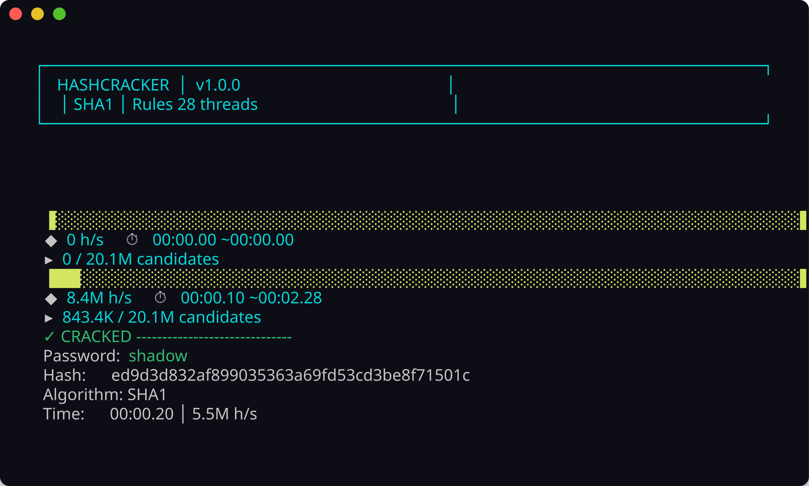

<!-- ©AngelaMos | 2026 -->
<!-- DEMO.md -->

<div align="center">

```ruby
██╗  ██╗ █████╗ ███████╗██╗  ██╗ ██████╗██████╗  █████╗  ██████╗██╗  ██╗███████╗██████╗
██║  ██║██╔══██╗██╔════╝██║  ██║██╔════╝██╔══██╗██╔══██╗██╔════╝██║ ██╔╝██╔════╝██╔══██╗
███████║███████║███████╗███████║██║     ██████╔╝███████║██║     █████╔╝ █████╗  ██████╔╝
██╔══██║██╔══██║╚════██║██╔══██║██║     ██╔══██╗██╔══██║██║     ██╔═██╗ ██╔══╝  ██╔══██╗
██║  ██║██║  ██║███████║██║  ██║╚██████╗██║  ██║██║  ██║╚██████╗██║  ██╗███████╗██║  ██║
╚═╝  ╚═╝╚═╝  ╚═╝╚══════╝╚═╝  ╚═╝ ╚═════╝╚═╝  ╚═╝╚═╝  ╚═╝ ╚═════╝╚═╝  ╚═╝╚══════╝╚═╝  ╚═╝
```

**Demonstração e Prévia**

<br>

<a href="https://github.com/CarterPerez-dev/Cybersecurity-Projects/tree/main/PROJECTS/beginner/hash-cracker">
  
</a>

<br>

```ruby
./install.sh    →    hashcracker --hash <hash> --wordlist <list>
```

<br>

[Ataque de Dicionário](#dictionary-attack) · [Mutações Baseadas em Regras](#rule-based-mutations)

</div>

---

### Ataque de Dicionário

Varredura de wordlist mapeada em memória com tipo de hash detectado automaticamente, trabalho particionado entre todos os núcleos, com barra de progresso em tempo real e taxa de transferência h/s



---

### Mutações Baseadas em Regras

Regras de mutação expandem uma wordlist de 10K para 20,1M de candidatos com transformações de capitalização, leet, anexação de dígitos, inversão e alternância de caixa aplicadas por palavra


