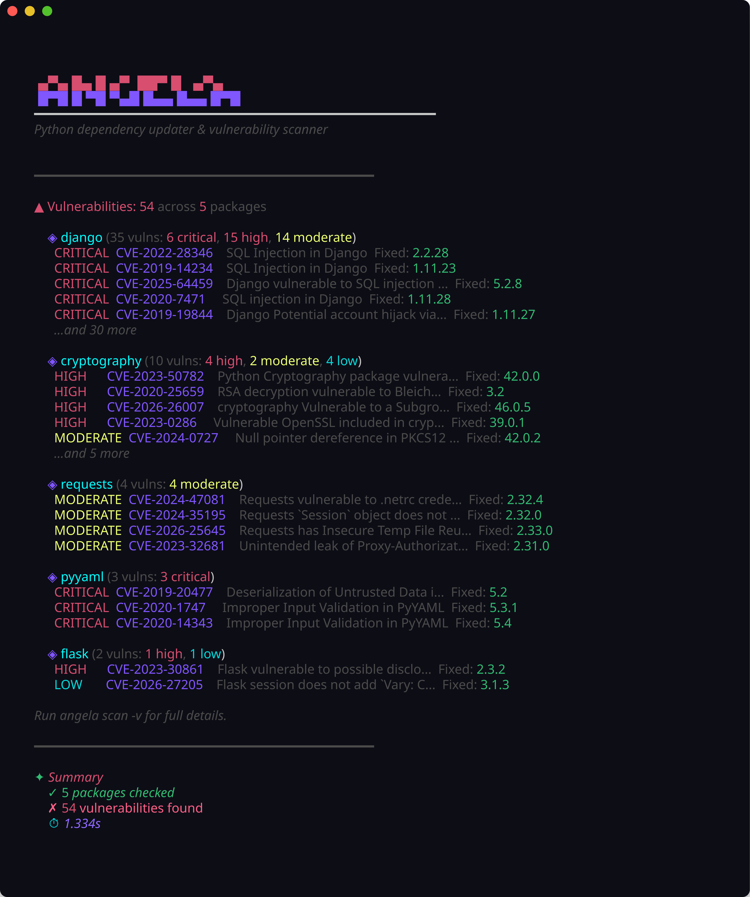

<!-- ©AngelaMos | 2026 -->
<!-- DEMO.md -->

<div align="center">

```ruby
 █████╗ ███╗   ██╗ ██████╗ ███████╗██╗      █████╗
██╔══██╗████╗  ██║██╔════╝ ██╔════╝██║     ██╔══██╗
███████║██╔██╗ ██║██║  ███╗█████╗  ██║     ███████║
██╔══██║██║╚██╗██║██║   ██║██╔══╝  ██║     ██╔══██║
██║  ██║██║ ╚████║╚██████╔╝███████╗███████╗██║  ██║
╚═╝  ╚═╝╚═╝  ╚═══╝ ╚═════╝ ╚══════╝╚══════╝╚═╝  ╚═╝
```

**Demonstração e Prévia**

<br>

<a href="https://pkg.go.dev/github.com/CarterPerez-dev/angela">
  
</a>

<br>

```ruby
go install github.com/CarterPerez-dev/angela/cmd/angela@latest
```

<br>

[Verificação de Atualização](#update-check) · [Scan de Vulnerabilidade](#vulnerability-scan)

</div>

---

### Verificação de Atualização

Consultas paralelas ao PyPI com parsing de versão PEP 440, expondo atualizações major e minor em dependências do pyproject.toml


---

### Scan de Vulnerabilidade

Integração com OSV.dev agrupando CVEs por pacote e severidade com a primeira versão corrigida por aviso


