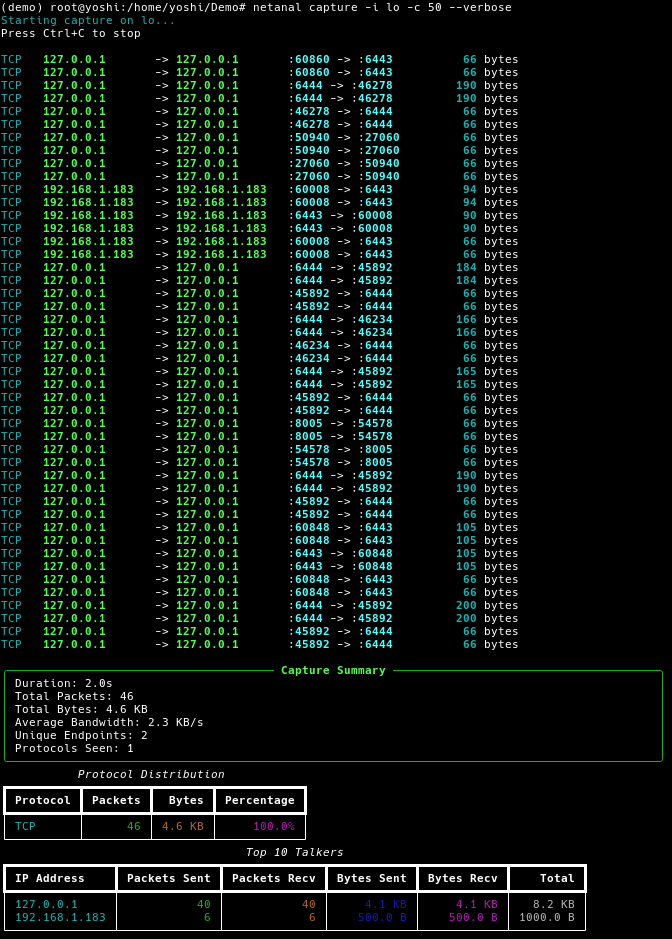

<!-- ©AngelaMos | 2026 -->
<!-- DEMO.md -->

<div align="center">

```ruby
███╗   ██╗███████╗████████╗     █████╗ ███╗   ██╗ █████╗ ██╗  ██╗   ██╗███████╗███████╗██████╗
████╗  ██║██╔════╝╚══██╔══╝    ██╔══██╗████╗  ██║██╔══██╗██║  ╚██╗ ██╔╝╚══███╔╝██╔════╝██╔══██╗
██╔██╗ ██║█████╗     ██║       ███████║██╔██╗ ██║███████║██║   ╚████╔╝   ███╔╝ █████╗  ██████╔╝
██║╚██╗██║██╔══╝     ██║       ██╔══██║██║╚██╗██║██╔══██║██║    ╚██╔╝   ███╔╝  ██╔══╝  ██╔══██╗
██║ ╚████║███████╗   ██║       ██║  ██║██║ ╚████║██║  ██║███████╗██║   ███████╗███████╗██║  ██║
╚═╝  ╚═══╝╚══════╝   ╚═╝       ╚═╝  ╚═╝╚═╝  ╚═══╝╚═╝  ╚═╝╚══════╝╚═╝   ╚══════╝╚══════╝╚═╝  ╚═╝
```

**Demonstração e Prévia**

<br>

```ruby
cd python && uv sync
sudo netanal capture -i eth0
```

```ruby
cd cpp && ./install.sh
just run -i eth0
```

</div>

---

### Captura e Análise em Tempo Real

Captura de pacotes em tempo real com log por pacote, estatísticas de resumo da captura, detalhamento da distribuição de protocolos e ranking dos principais emissores por bytes


