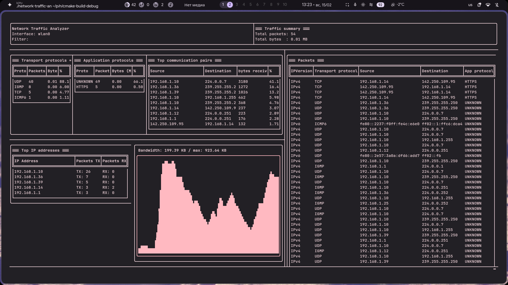

```ruby
▄▄▄▄▄▄ ▄▄▄▄   ▄▄▄  ▄▄▄▄▄ ▄▄▄▄▄ ▄▄  ▄▄▄▄    ▄▄▄  ▄▄  ▄▄  ▄▄▄  ▄▄  ▄▄ ▄▄ ▄▄▄▄▄ ▄▄▄▄▄ ▄▄▄▄
  ██   ██▄█▄ ██▀██ ██▄▄  ██▄▄  ██ ██▀▀▀   ██▀██ ███▄██ ██▀██ ██  ▀███▀   ▄█▀ ██▄▄  ██▄█▄
  ██   ██ ██ ██▀██ ██    ██    ██ ▀████   ██▀██ ██ ▀██ ██▀██ ██▄▄▄ █   ▄██▄▄ ██▄▄▄ ██ ██

```

> Um analisador de rede CLI de alto desempenho construído com libpcap para captura de pacotes brutos e FTXUI para uma UI de terminal totalmente interativa.
> A aplicação captura pacotes diretamente de uma interface de rede, analisa cabeçalhos de protocolo manualmente e agrega estatísticas em tempo real.

_Desenvolvido por [@deniskhud](https://github.com/deniskhud)_

---



> [!IMPORTANT]
> A captura de pacotes requer privilégios elevados.

Execute com:

```bash
sudo ./network-traffic-analyzer
```

Ou conceda as capabilities:

```bash
sudo setcap cap_net_raw,cap_net_admin=eip ./network-traffic-analyzer
```

Ou você pode usar o comando `just`:

```
just run
```

---

# Recursos

1. ## Captura de Pacotes em Tempo Real

- Captura tráfego de uma interface de rede selecionada
- Suporte para filtros BPF (ex: tcp, port 80, udp)
- Processamento em tempo real usando libpcap

2. ## Engine de Estatísticas em Tempo Real

- Total de pacotes e volume de tráfego
- Distribuição de protocolos de transporte (TCP / UDP / ICMP)
- Classificação em nível de aplicação (baseada em porta)
- Principais endereços IP
- Principais pares origem > destino

3. ## Modos de Captura Flexíveis

- Captura ao vivo da interface de rede selecionada (-i, --interface)
- Análise offline de arquivo .pcap (-r, --offline)
- Limite de contagem de pacotes (-c)
- Limite de tempo para captura (-t)
- Descoberta de interfaces (--interfaces)

> [!TIP]
> Para a lista completa de opções de CLI, use:
> `--help`

# Tecnologias

- C++20+
- Boost::program_options
- libpcap
- FTXUI
- CMake

# Configuração

## 1. clone o repositório e então

```bash
cd RedTeam/Team/c-Net_Analyzer/
./install.sh
```

# Exemplos de Uso

### Captura ao vivo na eth0

```
just capture -i eth0
```

### Capturar 100 pacotes

```
just run -i wlan0 -c 100
```

### Analisar arquivo pcap offline

```
just run --offline traffic.pcap
```

### Exportar resultados (json / csv)

```
just run --json result.json --csv result.csv
```

---

## Saiba Mais

| Doc                                                  | Conteúdo                                                                       |
| ---------------------------------------------------- | ------------------------------------------------------------------------------ |
| [00-OVERVIEW.md](./learn/00-OVERVIEW.md)             | Início rápido, pré-requisitos, estrutura do projeto                            |
| [01-CONCEPTS.md](./learn/01-CONCEPTS.md)             | Internos da libpcap, filtros BPF, parsing de cabeçalho de protocolo            |
| [02-ARCHITECTURE.md](./learn/02-ARCHITECTURE.md)     | Design do sistema, divisão de componentes, fluxo de dados, modelo de threading |
| [03-IMPLEMENTATION.md](./learn/03-IMPLEMENTATION.md) | Passo a passo do código linha por linha                                        |
| [04-CHALLENGES.md](./learn/04-CHALLENGES.md)         | Ideias de extensão e tópicos avançados                                         |
