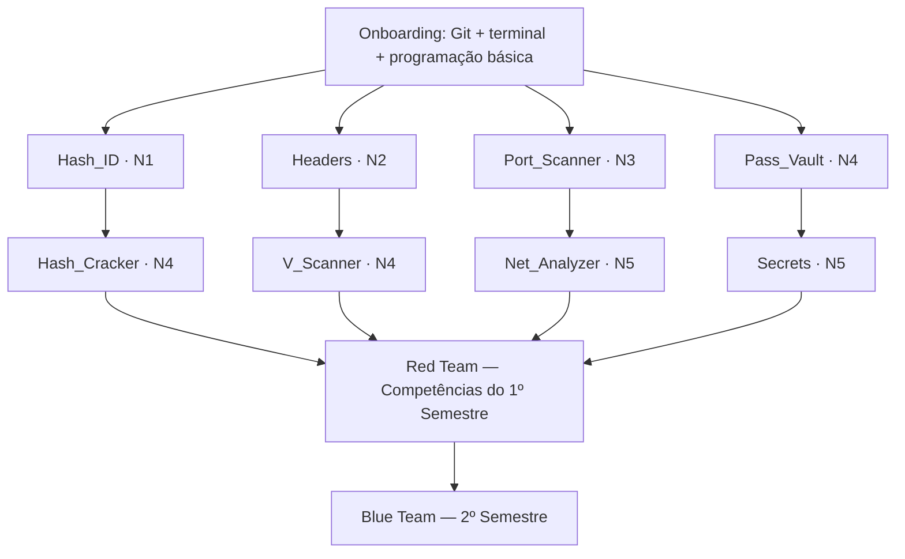

# 🗺️ Mapa Curricular — Insper Sec Projects

> Documento transversal que define a progressão, os ramos temáticos, os níveis de dificuldade e a relação entre os projetos do repositório.

---

## 1. Filosofia

O repositório é uma **trilha educacional**, não um inventário de ferramentas. Cada projeto tem um papel pedagógico claro: ensinar um conjunto de conceitos, exigir um esforço previsível e preparar o membro para o próximo passo.

A progressão é organizada em **semestres**, cada um com um objetivo pedagógico distinto:

- **1º Semestre — Red Team:** foco ofensivo, fundamentos e construção de ferramentas.
- **2º Semestre — Blue Team:** foco defensivo, detecção, resposta e endurecimento.
- **3º+ Semestre — Purple Team:** atividade integradora que une ofensiva e defensiva.

Dentro de cada semestre, a progressão **não é linear**. O currículo é organizado em **ramos temáticos paralelos**, cada um com sua própria cadeia de projetos (Individual → Team).

---

## 2. Frentes (Teams) e Semestres

|     Frente      | Semestre | Cor |    Foco    | Papel pedagógico                                                    |
| :-------------: | :------: | :-: | :--------: | ------------------------------------------------------------------- |
|  **Red Team**   |    1º    | 🔴  |  Ofensivo  | Observar, mapear, testar e explorar sistemas em contexto autorizado |
|  **Blue Team**  |    2º    | 🔵  | Defensivo  | Observar, detectar, investigar, responder e endurecer sistemas      |
| **Purple Team** |   3º+    | 💜  | Integração | Executar Red → detectar Blue → refletir e melhorar a trilha         |

> **Modelo semestral:** dentro de cada semestre, o projeto **Individual** representa uma **entrega intermediária**, e o projeto **Team** representa a **entrega final do semestre**, com apresentação à Insper Sec.

---

## 3. Níveis de Dificuldade

A dificuldade é **sempre explícita e separada do domínio/tema**. As letras A/B/C/D nos nomes de pasta indicam **ramo temático**, não dificuldade.

São **5 níveis de dificuldade**, de N1 a N5:

| Nível | Rótulo        | Descrição                                                     |
| ----- | ------------- | ------------------------------------------------------------- |
| N1    | Iniciante     | Fundamentos, escopo contido, sem barreira de tooling          |
| N2    | Básico        | Primeiros conceitos aplicados, tooling simples                |
| N3    | Intermediário | Engenharia aplicada, exige domínio de conceitos e ferramentas |
| N4    | Avançado      | Projeto complexo, exige maturidade técnica e integração       |
| N5    | Especialista  | Projeto de alto nível, exige domínio profundo e arquitetura   |

---

## 4. Ramos Temáticos (Red Team — 1º Semestre)

Os projetos Red são organizados em **quatro ramos temáticos paralelos**:

| Ramo  | Tema                   | Individual     | Team           | Dificuldade (Ind → Team) |
| ----- | ---------------------- | -------------- | -------------- | ------------------------ |
| **A** | Cryptography & Hashing | `Hash_ID`      | `Hash_Cracker` | N1 → N4                  |
| **B** | Web & Supply Chain     | `Headers`      | `V_Scanner`    | N2 → N4                  |
| **C** | Network Security       | `Port_Scanner` | `Net_Analyzer` | N3 → N5                  |
| **D** | Secrets & Detection    | `Pass_Vault`   | `Secrets`      | N4 → N5                  |

> **Nota sobre o Ramo B:** `V_Scanner` é um scanner de **dependências Python / supply chain** (Go, OSV.dev, PyPI), não um scanner de vulnerabilidades web genérico. Ele faz a ponte entre o tema web (`Headers`) e a frente defensiva (Blue Team).

---

## 5. Grafo de Progressão

> Todos os 8 projetos consolidados pertencem ao **Red Team** (1º semestre). O Blue Team (2º semestre) e o Purple Team (3º+ semestre) são fases posteriores da trilha.

---

## 6. Projetos Blue Team (2º Semestre — Planejados)

A frente Blue está em construção. Os projetos abaixo estão **planejados** e serão detalhados conforme forem implementados:

### Individual

- `Canary_Token_Generator` — geração de tokens canário para detecção de acesso não autorizado
- `Metadata_Scrubber_Tool` — remoção de metadados sensíveis de arquivos
- `Systemd_Persist_Scan` — detecção de persistência via systemd
- `V_Scanner` — scanner de dependências (ponte com Red, perfil defensivo)

### Team

- `DLP_Scanner` — prevenção de vazamento de dados
- `Docker_Security_Audit` — auditoria de segurança de containers
- `Honeypot_Network` — rede de honeypots para detecção de intrusão
- `SBOM_Generator&Vulnerability` — geração de SBOM e análise de vulnerabilidades

---

## 7. Purple Team (3º+ Semestre)

Em construção. 🏗️

---

## 8. Resumo de Dificuldade por Projeto

| Projeto        | Modo       | Dificuldade   | Nível |
| -------------- | ---------- | ------------- | ----- |
| `Hash_ID`      | Individual | Iniciante     | N1    |
| `Headers`      | Individual | Básico        | N2    |
| `Port_Scanner` | Individual | Intermediário | N3    |
| `Pass_Vault`   | Individual | Avançado      | N4    |
| `Hash_Cracker` | Team       | Avançado      | N4    |
| `V_Scanner`    | Team       | Avançado      | N4    |
| `Net_Analyzer` | Team       | Especialista  | N5    |
| `Secrets`      | Team       | Especialista  | N5    |

---

## 9. Onboarding

1. Leia o [`README.md`](../README.md) raiz.
2. Escolha um ramo temático no [`RedTeam`](../RedTeam/README.md).
3. Comece pelo projeto **Individual** do ramo escolhido.
4. Siga para o projeto **Team** do mesmo ramo (entrega final do semestre).
5. Ao final do semestre, avance para o **Blue Team** (2º semestre).
6. No 3º+ semestre, participe do **Purple Team**.
