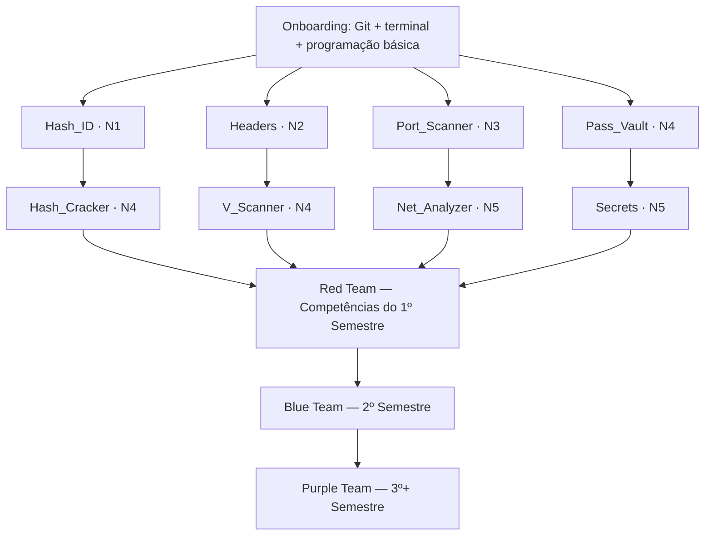

# 🛡️ Trilha de Projetos em Cibersegurança — Sec_Projects

> [!NOTE]
> Documentação central unificada de todos os projetos educacionais do **Insper Sec**. Esta página consolida as frentes Red Team, Blue Team e Purple Team, assim como a progressão, os ramos temáticos e o catálogo completo de projetos.

Bem-vindo ao coração da trilha em cibersegurança do Insper Sec.

Este documento é o **guia de referência** da trilha: ajuda a entender a progressão dos projetos, navegar pelas frentes e começar sem ficar perdido. Cada projeto tem um papel claro na jornada, e o objetivo é ir montando a base antes de partir pra coisa mais pesada.

---

## 🧭 Filosofia da Trilha

O repositório `Sec_Projects` é uma **trilha educacional**, não um inventário de ferramentas. A estrutura geral do currículo continua sendo pensada em frentes e ramos, mas o semestre atual foi organizado para refletir a realidade da turma de **2026/2**.

|  Frente atual   | Perfil do grupo  | Situação neste semestre  |                           Papel pedagógico                           |
| :-------------: | :--------------: | :----------------------: | :------------------------------------------------------------------: |
|  **Red Team**   | membros entrando |          ativa           |          onboarding, fundamentos e primeiro grande projeto           |
|  **Blue Team**  | membros antigos  |          ativa           | mesma trilha-base do Red Team, com revisão e aprofundamento aplicado |
| **Purple Team** |    integração    | não ativo neste semestre |                  será estruturado mais para frente                   |

Dentro deste semestre:

- O projeto **Individual** representa uma **entrega intermediária** — foco em fundamentos.
- O projeto **Team** representa a **entrega final do semestre** — foco em integração e complexidade, com apresentação à Insper Sec.
- O **Red Team** e o **Blue Team** seguem o **mesmo catálogo de 8 projetos** do semestre.
- O **team final é misto entre Blue e Red**, em grupos compartilhados.
- Os nomes de projetos alternativos fora do catálogo consolidado são apenas **planejamento** e não possuem conteúdo implementado neste repositório.

> [!TIP]
> A progressão **não é linear**. O currículo continua em ramos temáticos paralelos, mas a turma do momento redefine como a trilha roda nesse semestre.

---

## 📚 Estrutura Pedagógica

### Red Team — onboarding do semestre atual

O Red Team neste semestre representa a turma que está entrando no ciclo, com foco em aprender a base da segurança por meio de projetos mais introdutórios e de execução mais focada.

A proposta aqui continua sendo desenvolver base técnica sólida em áreas como hashes, aplicações web, redes, credenciais e segredos. A diferença é que, neste ciclo, o Red Team roda em um formato mais enxuto: **um projeto individual + um team**.

**Calendário do Red Team (semestre atual):**

| Projeto        | Modo       | Janela de entrega |
| -------------- | ---------- | ----------------- |
| `Hash_ID`      | Individual | 09 Set – 07 Out   |
| `Headers`      | Individual | 09 Set – 07 Out   |
| `Port_Scanner` | Individual | 09 Set – 07 Out   |
| `Pass_Vault`   | Individual | 09 Set – 07 Out   |
| `Hash_Cracker` | Team       | 14 Out – 02 Dez   |
| `V_Scanner`    | Team       | 14 Out – 02 Dez   |
| `Net_Analyzer` | Team       | 14 Out – 02 Dez   |
| `Secrets`      | Team       | 14 Out – 02 Dez   |

> Observação: o calendário acima continua sendo o da trilha pedagógica base, mas no semestre atual a composição da turma e o conjunto de projetos executados pode ser ajustado conforme a carga real.

### Blue Team — membros mais antigos

O Blue Team neste semestre é composto pelos membros mais antigos, mas **segue a mesma trilha-base do Red Team**: os mesmos 8 projetos, com a mesma lógica de Individual → Team e a mesma janela final de execução.

A diferença principal não está no catálogo, e sim no **perfil de execução**: o grupo mais antigo revisita os mesmos temas com mais criticidade, mais refinamento e mais foco em praticar bem o que já foi visto.

**Calendário atual do Blue Team:**

| Projeto        | Modo       | Janela de entrega |
| -------------- | ---------- | ----------------- |
| `Hash_ID`      | Individual | 20 Ago – 08 Out   |
| `Headers`      | Individual | 20 Ago – 08 Out   |
| `Port_Scanner` | Individual | 20 Ago – 08 Out   |
| `Pass_Vault`   | Individual | 20 Ago – 08 Out   |
| `Hash_Cracker` | Team       | 14 Out – 02 Dez   |
| `V_Scanner`    | Team       | 14 Out – 02 Dez   |
| `Net_Analyzer` | Team       | 14 Out – 02 Dez   |
| `Secrets`      | Team       | 14 Out – 02 Dez   |

> [!IMPORTANT]
> O conjunto de nomes como `Canary_Token_Generator`, `Metadata_Scrubber_Tool`, `Systemd_Persist_Scan`, `DLP_Scanner` e similares continua sendo apenas **planejamento didático**. Eles não são parte do catálogo consolidado do semestre e não possuem conteúdo implementado em pastas neste repositório.

### Purple Team — ainda não ativo neste semestre

O Purple Team integra ofensiva e defensiva em uma atividade capstone. Neste momento, ele ainda não está ativo no semestre atual, e a estrutura final será construída mais para frente.

Enquanto isso, o foco do semestre é:

- **Red Team** = onboarding e base técnica;
- **Blue Team** = aprofundamento defensivo e continuidade de maturidade;
- **Team misto** = integração prática entre as duas frentes.

> [!NOTE]
> Purple Team está **em construção** para uma etapa futura. Neste ciclo não há uma estrutura de Purple Team ativa.

---

## 🎯 Níveis de Dificuldade

A dificuldade é **sempre explícita e separada do domínio/tema**. As letras **A/B/C/D** nos nomes de pasta indicam **ramo temático**, não dificuldade.

| Nível | Rótulo        | Descrição                                                     |
| ----- | ------------- | ------------------------------------------------------------- |
| N1    | Iniciante     | Fundamentos, escopo contido, sem barreira de tooling          |
| N2    | Básico        | Primeiros conceitos aplicados, tooling simples                |
| N3    | Intermediário | Engenharia aplicada, exige domínio de conceitos e ferramentas |
| N4    | Avançado      | Projeto complexo, exige maturidade técnica e integração       |
| N5    | Especialista  | Projeto de alto nível, exige domínio profundo e arquitetura   |

---

## 🧩 Ramos Temáticos (Red Team)

Os projetos Red são organizados em **quatro ramos temáticos paralelos**:

| Ramo  | Tema                   | Individual     | Team           | Dificuldade |
| ----- | ---------------------- | -------------- | -------------- | ----------- |
| **A** | Cryptography & Hashing | `Hash_ID`      | `Hash_Cracker` | N1 → N4     |
| **B** | Web & Supply Chain     | `Headers`      | `V_Scanner`    | N2 → N4     |
| **C** | Network Security       | `Port_Scanner` | `Net_Analyzer` | N3 → N5     |
| **D** | Secrets & Detection    | `Pass_Vault`   | `Secrets`      | N4 → N5     |

> **Nota especial sobre o Ramo B:** `V_Scanner` é um scanner de **dependências Python / supply chain** (Go, OSV.dev, PyPI), não um scanner de vulnerabilidades web genérico. Ele faz a ponte entre o tema web (`Headers`) e a frente defensiva (Blue Team).

---

## 📊 Catálogo Completo de Projetos

### Red Team — 1º Semestre

#### Ramo A — Cryptography & Hashing

##### Individual: Hash_ID

**Objetivo:** Identificar algoritmos de hash a partir de sua saída (fingerprint, padrão, comportamento).

**O que você vai aprender:**

- Características de diferentes funções hash (MD5, SHA-1, SHA-256, etc.)
- Padrões de output e identificação visual
- Fundamentos de hashing criptográfico
- Como hash é usado em contextos reais

**Stack:** Python

**Learning Resources:** Veja [`Individual/a-Hash_ID/README.md`](./Individual/a-Hash_ID/README.md) para o contrato educacional completo.

**Next Step:** Avance para `Hash_Cracker` (Team) após conclusão.

---

##### Team: Hash_Cracker

**Objetivo:** Construir uma ferramenta capaz de quebrar hashes usando técnicas de brute force, dicionário e otimizações paralelas.

**O que você vai aprender:**

- Otimização e paralelismo (threads, SIMD)
- Ataques offline contra hashes
- Performance crítica em C++
- Integração de wordlists e estratégias de ataque

**Stack:** C++

**Learning Resources:** Veja [`Team/a-Hash_Cracker/README.md`](./Team/a-Hash_Cracker/README.md) para o contrato educacional completo.

**Progressão:** Evolução natural de Hash_ID com foco em engenharia prática.

---

#### Ramo B — Web & Supply Chain

##### Individual: Headers

**Objetivo:** Analisar headers HTTP para extrair informações de segurança, configuração e pegada de servidores.

**O que você vai aprender:**

- Anatomia de headers HTTP
- Headers de segurança (CSP, X-Frame-Options, Strict-Transport-Security, etc.)
- Fingerprinting de servidores e tecnologias
- Descoberta de tecnologia via análise passiva

**Stack:** Python

**Learning Resources:** Veja [`Individual/b-Headers/README.md`](./Individual/b-Headers/README.md) para o contrato educacional completo.

**Next Step:** Avance para `V_Scanner` (Team) após conclusão.

---

##### Team: V_Scanner

**Objetivo:** Construir um scanner de dependências Python que identifica vulnerabilidades em supply chain usando OSV.dev e PyPI.

**O que você vai aprender:**

- Supply chain security
- APIs de vulnerabilidade (OSV.dev)
- Análise de dependências
- Go para ferramentas de segurança
- Integração com ecosistemas de pacotes

**Stack:** Go

**Learning Resources:** Veja [`Team/b-V_Scanner/README.md`](./Team/b-V_Scanner/README.md) para o contrato educacional completo.

**Progressão:** Evolução natural de Headers com foco em segurança de supply chain.

---

#### Ramo C — Network Security

##### Individual: Port_Scanner

**Objetivo:** Implementar um scanner de portas que mapeia serviços e versões em hosts remotos.

**O que você vai aprender:**

- Sockets e programação de rede (raw sockets, conectividade)
- Técnicas de scanning (SYN, connect, UDP)
- Timeout e tratamento de erros de rede
- Mapeamento de ativos e inventário de serviços

**Stack:** C++

**Learning Resources:** Veja [`Individual/c-Port_Scanner/README.md`](./Individual/c-Port_Scanner/README.md) para o contrato educacional completo.

**Next Step:** Avance para `Net_Analyzer` (Team) após conclusão.

---

##### Team: Net_Analyzer

**Objetivo:** Construir um analisador de tráfego que captura, decodifica e interpreta protocolos de rede em tempo real.

**O que você vai aprender:**

- Captura de pacotes e análise de tráfego
- Decodificação de protocolos (TCP/IP, DNS, HTTP, etc.)
- Reconstrução de sessões
- Análise forense de tráfego

**Stack:** Python / C++

**Learning Resources:** Veja [`Team/c-Net_Analyzer/README.md`](./Team/c-Net_Analyzer/README.md) para o contrato educacional completo.

**Progressão:** Evolução natural de Port_Scanner com foco em análise profunda.

---

#### Ramo D — Secrets & Detection

##### Individual: Pass_Vault

**Objetivo:** Implementar um gerenciador de senhas seguro que armazena credenciais com criptografia forte e práticas de segurança.

**O que você vai aprender:**

- Armazenamento seguro de senhas (KDF, salt, algoritmos modernos)
- Derivação de chaves (PBKDF2, Argon2, scrypt)
- Criptografia simétrica (AES-256-GCM)
- Proteção de segredos contra ataques de side-channel
- Boas práticas de gerenciamento de credenciais

**Stack:** Python

**Learning Resources:** Veja [`Individual/d-Pass_Vault/README.md`](./Individual/d-Pass_Vault/README.md) para o contrato educacional completo.

**Next Step:** Avance para `Secrets` (Team) após conclusão.

---

##### Team: Secrets

**Objetivo:** Construir uma ferramenta que detecta exposição de segredos em repositórios e artefatos.

**O que você vai aprender:**

- Detecção de padrões de segredos
- Scanning de repositórios Git
- Análise de artefatos (binários, logs, configurações)
- Resposta a vazamentos
- Integração com CI/CD para detecção precoce

**Stack:** Go

**Learning Resources:** Veja [`Team/d-Secrets/README.md`](./Team/d-Secrets/README.md) para o contrato educacional completo.

**Progressão:** Evolução natural de Pass_Vault com foco em detecção operacional.

---

### Blue Team — catálogo compartilhado do semestre

Os nomes abaixo aparecem como **planejamento acadêmico**, mas **não fazem parte do catálogo consolidado do semestre**. O que está efetivamente em execução é o mesmo conjunto de 8 projetos do Red Team, já incorporado ao repositório e com conteúdo completo em suas pastas.

#### Planejamento não consolidado

| Projeto                        | Tema          | Descrição                                                        | Status    |
| ------------------------------ | ------------- | ---------------------------------------------------------------- | --------- |
| `Canary_Token_Generator`       | Detecção      | Geração de tokens canário para detecção de acesso não autorizado | Planejado |
| `Metadata_Scrubber_Tool`       | Endurecimento | Remoção de metadados sensíveis de arquivos                       | Planejado |
| `Systemd_Persist_Scan`         | Detecção      | Detecção de persistência maliciosa via systemd                   | Planejado |
| `DLP_Scanner`                  | Prevenção     | Prevenção de vazamento de dados                                  | Planejado |
| `Docker_Security_Audit`        | Endurecimento | Auditoria de segurança de containers Docker                      | Planejado |
| `Honeypot_Network`             | Detecção      | Rede de honeypots para detecção e análise de intrusão            | Planejado |
| `SBOM_Generator&Vulnerability` | Supply chain  | Geração de SBOM e análise de vulnerabilidades                    | Planejado |

> [!NOTE]
> Esses nomes não devem ser interpretados como substitutos do catálogo ativo. O **catálogo ativo do semestre** continua sendo: `Hash_ID`, `Headers`, `Port_Scanner`, `Pass_Vault`, `Hash_Cracker`, `V_Scanner`, `Net_Analyzer` e `Secrets`.

---

### Purple Team — 3º+ Semestre (Integração)

**Status:** Em construção. 🏗️

O Purple Team não possui projetos específicos no momento. Esta é a fase integradora onde você:

- Executará Red Team contra um alvo autorizado
- Detectará usando técnicas Blue Team
- Refletirá sobre a postura defensiva
- Contribuirá melhorias à trilha

---

## 📈 Grafo de Progressão

---

## 🚀 Por Onde Começar?

Se você é **novo(a) no Insper Sec**, siga este fluxo:

1. **Leia este README** para entender o mapa geral.
2. **Escolha um ramo temático** (A/B/C/D) baseado em seu interesse e background:
   - **A (Cryptography):** Interesse em fundamentos matemáticos e segurança de dados
   - **B (Web & Supply Chain):** Interesse em aplicações web e gerenciamento de dependências
   - **C (Network Security):** Interesse em redes, infraestrutura e análise de tráfego
   - **D (Secrets & Detection):** Interesse em detecção de comprometimento
3. **Comece pelo projeto Individual** do ramo escolhido.
4. **Siga para o projeto Team** do mesmo ramo (entrega final do semestre).
5. **Ao final do semestre**, avance para o **Blue Team** (2º semestre).
6. **No 3º+ semestre**, participe do **Purple Team**.

> [!IMPORTANT]
> **Primeiro passo concreto:** abra [`Individual/a-Hash_ID/README.md`](./Individual/a-Hash_ID/README.md) e siga o "Getting Started". É o ponto de entrada recomendado para quem nunca fez um projeto de segurança.

---

## 📚 Recursos Adicionais

Para uma visão ainda mais completa:

- **Mapa curricular detalhado:** [`../docs/CURRICULUM.md`](../docs/CURRICULUM.md)
- **Workflow operacional:** [`../docs/WORKFLOW.md`](../docs/WORKFLOW.md)
- **Guia de demo/apresentação:** [`../docs/DEMO_GUIDE.md`](../docs/DEMO_GUIDE.md)
- **Guia de contribuição:** [`../CONTRIBUTING.md`](../CONTRIBUTING.md)

---

## ⚠️ Aviso Legal

> [!IMPORTANT]
> Todos os projetos deste repositório devem ser executados somente em ambientes próprios ou explicitamente autorizados. O uso indevido das ferramentas aqui desenvolvidas é de responsabilidade exclusiva do usuário.
>
> Antes de executar qualquer ferramenta ou ataque, **obtenha autorização escrita** do dono ou administrador do sistema. Violação das leis de segurança cibernética é crime.

---

Boa exploração — com responsabilidade. 🛡️
